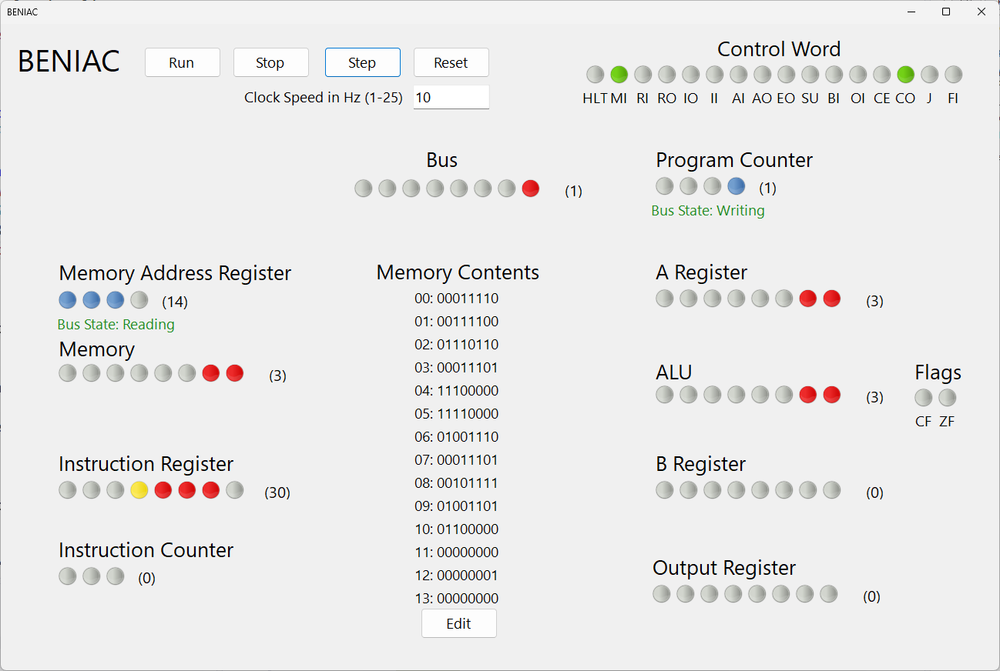

# BENIAC Breadboard Computer Emulator - Inspired by Ben Eater

Welcome to my Breadboard Computer Emulator project! This project is a personal endeavor to emulate the incredible breadboard computer created by Ben Eater on his YouTube channel.

## Overview

This project is a work in progress and aims to replicate the functionality of Ben Eater's breadboard computer in C#. The goal is to have fun and build a virtual computer that is more easily modified than Ben's breadboard version.

## Why Build a Breadboard Computer?

Building a breadboard computer allows you to:

- **Learn Computer Architecture**: Understand the fundamental principles of how a computer works at the hardware level.
- **Explore Digital Electronics**: Gain hands-on experience with digital components like transistors, capacitors, and integrated circuits.
- **Improve Problem-Solving Skills**: Tackle complex problems and develop a systematic approach to troubleshooting.
- **Appreciate Modern Computers**: Gain a greater appreciation for the complexity and elegance of modern computer systems.

## Resources

For detailed tutorials and explanations, check out Ben Eater's YouTube playlist on building a breadboard computer:

[Ben Eater's Breadboard Computer Playlist](https://www.youtube.com/playlist?list=PLowKtXNTBypGqImE405J2565dvjafglHU)

## Warning

Not yet compatible with DPI scaled monitors...

## Progress

- [x] Build core logic
- [x] Build Console App
- [x] Build Win App
- [x] Create UI to view memory
- [x] Create UI to edit memory
- [ ] Create UI to view logs
- [ ] Fix DPI Scaling
Stay tuned for updates as the project progresses!

## Contributions

Feel free to fork this repository and contribute your improvements or suggestions. Pull requests are welcome!

## License

This project is licensed under the MIT License. See the [LICENSE](LICENSE) file for more information.

---

Thanks for checking out my Breadboard Computer project! If you have any questions or feedback, please don't hesitate to reach out.
